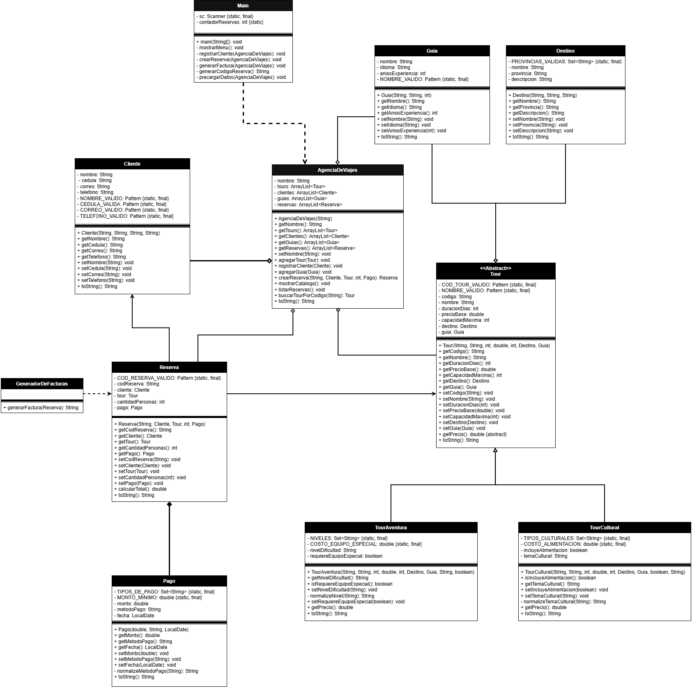

# Costa Rica Tours 🌎

Sistema de consola para la gestión de agencias de viajes nacional, desarrollado en **Java** como proyecto del curso de Programación Orientada a Objetos (SOFT-04, CENFOTEC).

La aplicación permite registrar clientes, consultar un catálogo de tours, crear reservas con su respectivo pago y generar facturas, aplicando los cuatro pilares de la POO: **encapsulamiento, abstracción, herencia y polimorfismo**.

---

## Tabla de contenidos

- [Descripción del proyecto](#descripción-del-proyecto)
- [Características](#características)
- [Conceptos de POO aplicados](#conceptos-de-poo-aplicados)
- [Estructura de clases](#estructura-de-clases)
- [Diagrama UML](#diagrama-uml)
- [Relaciones entre clases](#relaciones-entre-clases)
- [Cómo ejecutar el proyecto](#cómo-ejecutar-el-proyecto)
- [Uso del menú](#uso-del-menú)
- [Ejemplo de factura](#ejemplo-de-factura)
- [Autor](#autor)

---

## Descripción del proyecto

Costa Rica Tours es una agencia ficticia que ofrece tours por distintos destinos del país. El sistema modela la operación de la agencia: cada **tour** tiene un destino y un guía asignado, los **clientes** realizan **reservas** sobre esos tours, cada reserva lleva asociado un **pago**, y a partir de la reserva se puede generar una **factura**.

El proyecto funciona enteramente desde la consola, con un menú interactivo y datos de ejemplo precargados para facilitar las pruebas.

---

## Características

- Registro de clientes con validación de cédula, correo y teléfono.
- Catálogo de tours con dos tipos: tours de aventura y tours culturales.
- Creación de reservas con cálculo automático del total y validación de capacidad.
- Pago obligatorio asociado a cada reserva (composición).
- Generación de facturas con formato legible para el cliente.
- Listado de todas las reservas registradas.
- Generación automática de códigos de reserva (`RES-0001`, `RES-0002`, ...).
- Validaciones robustas en todas las clases mediante setters y expresiones regulares.
- Datos de ejemplo precargados (2 destinos, 2 guías y 3 tours).

---

## Conceptos de POO aplicados

| Concepto | Dónde se aplica |
|----------|-----------------|
| **Encapsulamiento** | Todos los atributos son privados y se accede a ellos mediante getters y setters con validación. |
| **Abstracción** | La clase `Tour` es abstracta y define el método abstracto `getPrecio()`. |
| **Herencia** | `TourAventura` y `TourCultural` heredan de `Tour`. |
| **Polimorfismo** | Cada subclase implementa `getPrecio()` y `toString()` a su manera; el menú las trata de forma uniforme sin conocer su tipo. |

---

## Estructura de clases

El proyecto está compuesto por 11 clases:

| Clase | Responsabilidad |
|-------|-----------------|
| `Cliente` | Representa a la persona que reserva (nombre, cédula, correo, teléfono). |
| `Guia` | Representa a un guía turístico (nombre, idioma, años de experiencia). |
| `Destino` | Guarda la información de un lugar de Costa Rica (nombre, provincia, descripción). |
| `Tour` *(abstracta)* | Define los atributos y validaciones comunes a todos los tours. |
| `TourAventura` | Tour con nivel de dificultad; suma un costo si requiere equipo especial. |
| `TourCultural` | Tour cultural; suma un costo si incluye alimentación. |
| `Pago` | Representa el pago de una reserva (monto, método, fecha). |
| `Reserva` | Une cliente, tour, cantidad de personas y pago; calcula el total. |
| `GeneradorDeFacturas` | Recibe una reserva y produce el texto de la factura. |
| `AgenciaDeViajes` | Administra las listas de tours, clientes, guías y reservas. |
| `Main` | Muestra el menú, lee al usuario y coordina las operaciones. |

---

## Diagrama UML

El siguiente diagrama muestra las 11 clases del proyecto y sus relaciones (herencia, composición, agregación, dependencia y asociación):



> 📄 También disponible en formato PDF: [UML Portafolio de Evidencias.pdf](UML/UML Portafolio de Evidencias.pdf)

---

## Relaciones entre clases

El proyecto implementa los cuatro tipos de relación entre clases:

### Herencia
`TourAventura` y `TourCultural` **extienden** a `Tour`. Ambas reutilizan los atributos comunes mediante `super(...)` e implementan el método abstracto `getPrecio()` con su propia regla de negocio.

### Composición *(rombo relleno)*
`Reserva ◆—— Pago`. Toda reserva exige un Pago obligatorio: el constructor de Reserva no acepta un pago nulo y además válida que el monto cubra el total de la reserva. El pago carece de sentido fuera de la reserva a la que pertenece: nace junto con ella y deja de tener significado si la reserva desaparece.

### Agregación *(rombo hueco)*
- `AgenciaDeViajes ◇—— Tour`, `Cliente`, `Guia`, `Reserva` (las administra en listas).
- `Tour ◇—— Destino` y `Tour ◇—— Guia`.

A diferencia de la composición, las partes existen por su cuenta: un guía o un destino siguen existiendo aunque se elimine un tour.

### Dependencia *(línea punteada)*
- `GeneradorDeFacturas ┄┄▷ Reserva`: recibe la reserva como parámetro para generar la factura, pero no la guarda como atributo.
- `Main ┄┄▷ AgenciaDeViajes`: usa la agencia para operar el menú.

### Asociación *(línea simple)*
`Reserva ——▷ Cliente` y `Reserva ——▷ Tour`: la reserva conoce a ambos y guarda una referencia, pero no los crea ni los posee.

---

## Cómo ejecutar el proyecto

### Requisitos
- Java JDK 17 o superior (se usa el operador switch -> y Set.of(...)).
-  IntelliJ IDEA (recomendado) o cualquier IDE compatible con Java.

### Pasos

1. Clonar el repositorio:
   ```bash
   git clone https://github.com/TheNeonSpray/Portafolio_De_Evidencias_POO.git
   ```

2. Abrir la carpeta del proyecto en IntelliJ IDEA.

3. Esperar a que el IDE indexe el proyecto y configure el JDK 17.

4. Abrir la clase Main y pulsar el botón Run (▶).

El programa inicia en la consola con los datos de ejemplo precargados.

---

## Uso del menú

Al iniciar, el sistema precarga datos de ejemplo y muestra el siguiente menú:

```
===== COSTA RICA TOURS =====
1. Registrar cliente
2. Ver catálogo de tours
3. Crear reserva (con su pago)
4. Generar factura de una reserva
5. Listar reservas
0. Salir
```

- **Registrar cliente:** pide nombre, cédula, correo y teléfono, y crea un `Cliente`.
- **Ver catálogo de tours:** muestra todos los tours disponibles con su precio final.
- **Crear reserva:** se elige cliente y tour, se indica la cantidad de personas y se registra el pago en un solo paso.
- **Generar factura:** se elige una reserva y se imprime su factura con formato.
- **Listar reservas:** muestra todas las reservas registradas.
- **Salir:** termina el programa.

Todas las opciones manejan errores con `try/catch`, de modo que un dato inválido muestra un mensaje claro sin que el programa se cierre.

---

## Ejemplo de factura

```
==============================================
           COSTA RICA TOURS - FACTURA
==============================================
Reserva: RES-0001

CLIENTE
  Nombre: Juan Pérez
  Cédula: 123456789
  Correo: juan@correo.com
  Teléfono: 8888-8888

DETALLE DEL TOUR
  Tour: Caminata en el parque Arenal
  Destino: Volcán Arenal (Alajuela)
  Guía: María Rodríguez
  Duración: 2 días
  Precio por persona: ₡65000.0
  Cantidad de personas: 2

PAGO
  Método: SINPE
  Fecha: 2026-06-28

----------------------------------------------
  TOTAL: ₡130000.0
==============================================
        ¡Gracias por viajar con nosotros!
==============================================
```

---

## Autor
Alexandra Espinoza Brenes,

Proyecto desarrollado como parte del Portafolio de Evidencias del curso de Programación Orientada a Objetos (SOFT-04), CENFOTEC.